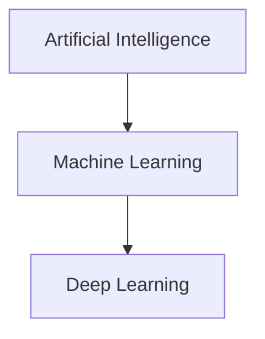
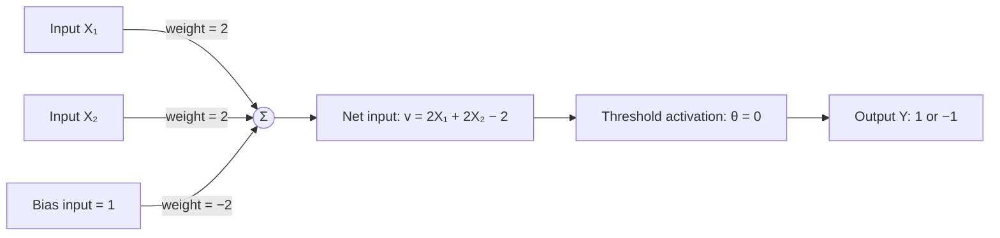

# Machine Learning: Introduction and Description

## 1. Relationship Between AI, Machine Learning, and Deep Learning

### Artificial Intelligence (AI)

AI is the broad field of making machines perform tasks that normally require human intelligence, such as reasoning, learning, problem-solving, and decision-making.

### Machine Learning (ML)

Machine Learning is a branch of AI where machines learn patterns from data and improve performance without being explicitly programmed for every rule.

### Deep Learning (DL)

Deep Learning is a subset of ML that uses multi-layered artificial neural networks to learn complex patterns from large datasets.

---

## 2. Genetic Algorithm

A **Genetic Algorithm (GA)** is an optimization and search technique inspired by natural evolution.

### Main Ideas of GA

- **Population:** A group of possible solutions.
- **Fitness function:** Measures how good a solution is.
- **Selection:** Chooses the best solutions.
- **Crossover:** Combines two solutions to create new ones.
- **Mutation:** Introduces small random changes.

### Applications

- Optimization problems
- Scheduling
- Routing
- Feature selection
- Machine-learning parameter tuning

---

## 3. Artificial Neural Network (ANN)

An **Artificial Neural Network (ANN)** is a computational model inspired by the human brain. It consists of interconnected processing units called neurons or nodes.

### Components of an ANN

1. **Neurons (nodes):** Basic processing units that receive input, compute an output, and pass signals forward.
2. **Weights:** Values representing the strength of connections between neurons.
3. **Bias:** An extra constant input used to shift the output.
4. **Activation function:** Determines a neuron's output from its net input.

---

## 4. Activation Functions

Activation functions introduce non-linearity into a neural network.

| Function | Description | Output |
| --- | --- | --- |
| Linear | Output is directly proportional to input. | Continuous |
| Threshold | Output changes at a specified cutoff value. | Binary / bipolar |
| Sigmoid | Smooth S-shaped curve, useful for probabilistic output. | 0 to 1 |

### Threshold Activation Function

The threshold activation function compares the neuron's net input, \(v\), with a threshold, \(\theta\). For a **bipolar** output:

\[
f(v) =
\begin{cases}
1, & v \geq \theta \\
-1, & v < \theta
\end{cases}
\]

For the AND example below, use \(\theta = 0\). Thus, the neuron returns `1` when the net input is zero or positive; otherwise it returns `-1`.

| Net input \(v\) | Output \(f(v)\) |
| --- | --- |
| \(v \geq 0\) | 1 |
| \(v < 0\) | -1 |

---

## 5. Types of Artificial Neural Networks

### Based on Architecture

1. **Single-layer feedforward network:** The input layer connects directly to the output layer; there is no hidden layer.
2. **Multilayer feedforward network:** Contains one or more hidden layers and is used for complex pattern recognition.
3. **Recurrent neural network (RNN):** Has feedback connections, so its output depends on previous states.
4. **Convolutional neural network (CNN):** Mainly used for image and spatial-data processing.

### Based on Learning

1. Supervised learning network
2. Unsupervised learning network
3. Reinforcement learning network

---

## 6. Hebbian Learning

### Donald Hebb (1949)

Donald Hebb introduced the Hebbian learning principle in 1949.

### Hebbian Network

A Hebbian network is an unsupervised feedforward network based on the following idea:

- If two connected neurons are activated synchronously, the weight increases.
- If two connected neurons are activated asynchronously, the weight decreases.

### Hebb's Rule

\[
\Delta w_i = X_i \times Y
\qquad
\Delta b = Y
\]

The updated weight is:

\[
w_{\text{new}} = w_{\text{old}} + \Delta w
\]

---

## 7. Design a Hebb Network to Implement the Logical AND Function

### Training Data

| \(X_1\) | \(X_2\) | Bias input | Target \(Y\) |
| ---: | ---: | ---: | ---: |
| 1 | 1 | 1 | 1 |
| 1 | -1 | 1 | -1 |
| -1 | 1 | 1 | -1 |
| -1 | -1 | 1 | -1 |

### Initial Values

\[
w_1 = 0, \qquad w_2 = 0, \qquad b = 0
\]

### Learning Rule

\[
\Delta w_1 = X_1 \times Y, \qquad
\Delta w_2 = X_2 \times Y, \qquad
\Delta b = Y
\]

### Training Table

| \(X_1\) | \(X_2\) | \(Y\) | \(\Delta w_1\) | \(\Delta w_2\) | \(\Delta b\) | New \(w_1\) | New \(w_2\) | New \(b\) |
| ---: | ---: | ---: | ---: | ---: | ---: | ---: | ---: | ---: |
| 1 | 1 | 1 | 1 | 1 | 1 | 1 | 1 | 1 |
| 1 | -1 | -1 | -1 | 1 | -1 | 0 | 2 | 0 |
| -1 | 1 | -1 | 1 | -1 | -1 | 1 | 1 | -1 |
| -1 | -1 | -1 | 1 | 1 | -1 | 2 | 2 | -2 |

### Final Values

\[
w_1 = 2, \qquad w_2 = 2, \qquad b = -2
\]

### Figure: Final Hebb Network for Logical AND

The final network computes:

\[
Y = f(2X_1 + 2X_2 - 2)
\]

Using the bipolar threshold activation function, the output is `1` only when \(X_1 = 1\) and \(X_2 = 1\). For all other input combinations, the output is `-1`.

---

## 8. Key Points to Remember

- AI is the broadest field; ML is a subset of AI; and DL is a subset of ML.
- ANN is inspired by biological neurons.
- Activation functions introduce non-linearity.
- Hebbian learning follows the idea: *neurons that fire together wire together*.
- For the AND network: \(w_1 = 2\), \(w_2 = 2\), and \(b = -2\).
