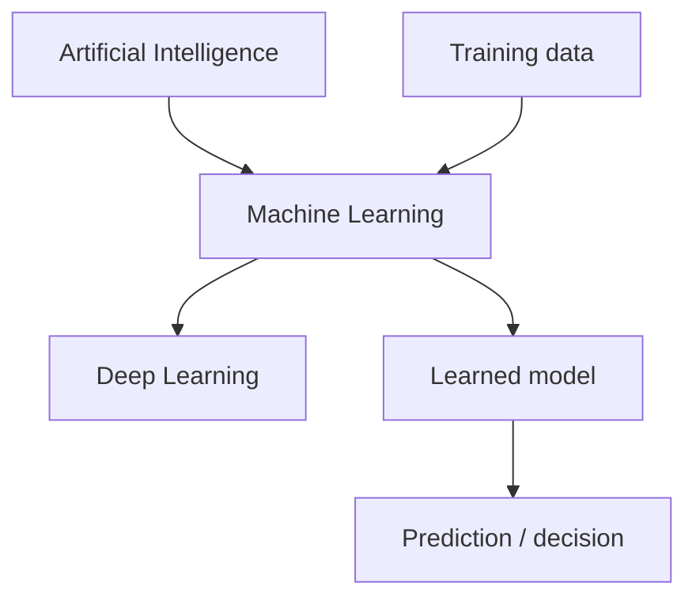
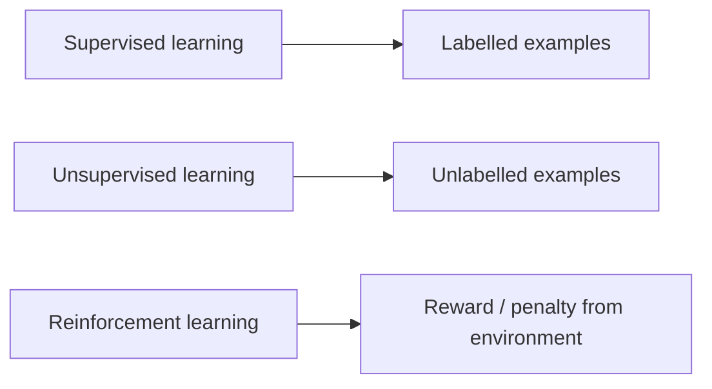
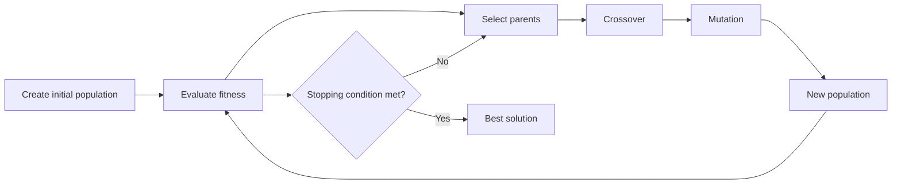
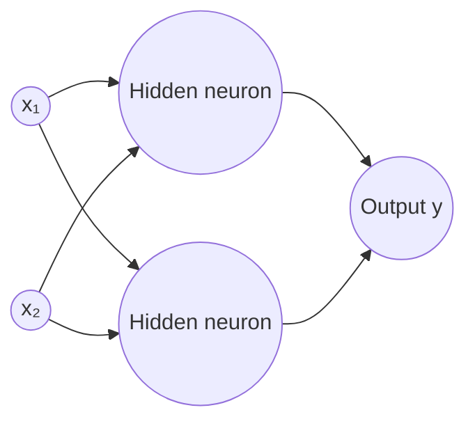
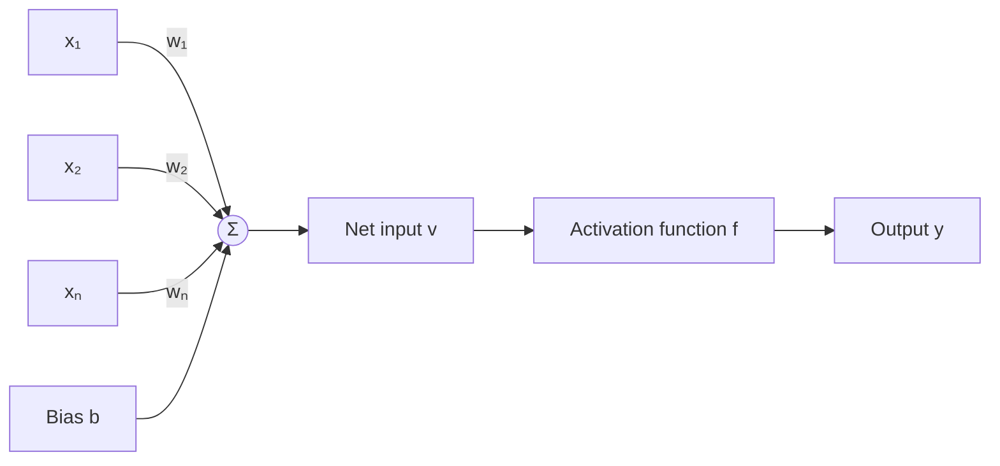
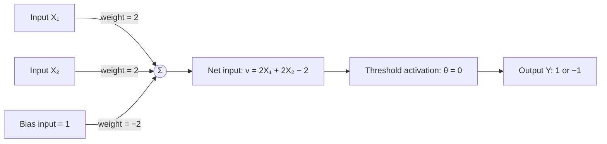
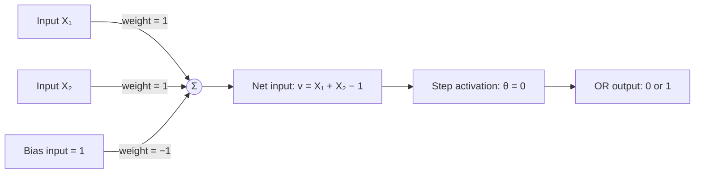
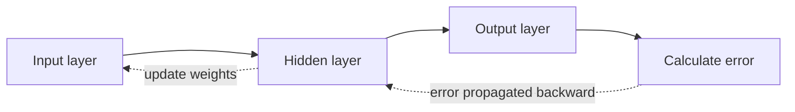

# Unit 5: Machine Learning

> **Syllabus coverage:** introduction to machine learning; statistical learning with Naive Bayes; genetic algorithms; neural networks; and Hebbian, perceptron, and back-propagation learning.

## 5.1 Introduction to Machine Learning

**Machine Learning (ML)** is a branch of Artificial Intelligence (AI) in which a computer learns patterns from data and uses them to make predictions or decisions. Instead of writing a separate rule for every situation, we provide examples and allow the system to improve its performance.



### Concepts of Learning

| Term | Meaning |
| --- | --- |
| **Training data** | Examples used to learn a model. |
| **Feature / attribute** | An input property used by the model, such as age or marks. |
| **Label / target** | The correct output in labelled data, such as `spam` or `not spam`. |
| **Model** | The learned relation between inputs and outputs. |
| **Training** | Adjusting model parameters using data. |
| **Testing** | Checking how well the trained model works on unseen data. |
| **Generalization** | Ability to perform well on new, unseen examples. |

### Types of Machine Learning

| Type | Data available | Goal | Example |
| --- | --- | --- | --- |
| **Supervised learning** | Input data with correct labels | Learn input-to-output mapping | Predict house price from area and location |
| **Unsupervised learning** | Input data without labels | Discover hidden groups or patterns | Group customers by purchasing behaviour |
| **Reinforcement learning** | Feedback as reward or penalty | Learn actions that maximize total reward | Robot learning to navigate a maze |



### Examples

- **Supervised:** classify an email as spam or not spam using previously labelled emails.
- **Unsupervised:** group news articles into topics without giving topic names beforehand.
- **Reinforcement:** train a game-playing agent by rewarding winning moves.

---

## 5.2 Statistical-Based Learning: Naive Bayes Model

**Naive Bayes** is a probabilistic classifier based on Bayes' theorem. It is called *naive* because it assumes that features are conditionally independent once the class is known.

### Bayes' Theorem

\[
P(C \mid X) = \frac{P(X \mid C)P(C)}{P(X)}
\]

Where:

- \(C\) is a class, for example `Spam`.
- \(X\) is the observed input or set of features.
- \(P(C)\) is the **prior probability** of the class.
- \(P(X \mid C)\) is the **likelihood** of observing \(X\) when \(C\) is true.
- \(P(C \mid X)\) is the **posterior probability** after observing \(X\).

For features \(X_1, X_2, \ldots, X_n\), Naive Bayes predicts the class with the largest score:

\[
\hat{C} = \arg\max_C P(C) \prod_{i=1}^{n} P(X_i \mid C)
\]

### Worked Example: Spam Classification

Suppose 10 emails are observed:

| Class | Number of emails | Contains `free` | Contains `offer` |
| --- | ---: | ---: | ---: |
| Spam | 4 | 3 | 2 |
| Not spam | 6 | 1 | 1 |

Classify an email containing both `free` and `offer`.

\[
P(Spam) = \frac{4}{10}, \qquad P(Not\ spam) = \frac{6}{10}
\]

\[
Score(Spam) = P(Spam)P(free \mid Spam)P(offer \mid Spam)
= \frac{4}{10} \times \frac{3}{4} \times \frac{2}{4} = 0.15
\]

\[
Score(Not\ spam) = \frac{6}{10} \times \frac{1}{6} \times \frac{1}{6}
\approx 0.0167
\]

Since \(0.15 > 0.0167\), the email is classified as **Spam**.

> In practical systems, **Laplace smoothing** is often used so that a feature with zero frequency does not make the whole probability zero.

---

## 5.3 Learning by Genetic Algorithms

A **Genetic Algorithm (GA)** is an optimization and search method inspired by biological evolution. A possible solution is represented as a chromosome; better solutions are more likely to produce new solutions.



### Important Terms and Operators

| Term / operator | Description |
| --- | --- |
| **Chromosome** | Encoded form of one candidate solution, for example `10110`. |
| **Population** | A set of chromosomes. |
| **Fitness function** | Measures the quality of each solution. Higher fitness is usually better. |
| **Selection** | Chooses parents, favouring fitter chromosomes. Common methods: roulette-wheel and tournament selection. |
| **Crossover** | Combines parts of two parents to create offspring. |
| **Mutation** | Randomly changes one or more genes to maintain diversity. |
| **Generation** | One complete cycle of evaluation and creation of a new population. |

### Example: Crossover and Mutation

Let the chromosomes be binary strings.

```text
Parent 1: 1 0 1 | 1 0
Parent 2: 0 1 0 | 0 1

One-point crossover after the third gene:
Child 1 : 1 0 1 | 0 1  = 10101
Child 2 : 0 1 0 | 1 0  = 01010

Mutation of Child 1 at the last gene:
10101  →  10100
```

### General Genetic Algorithm

1. Encode each candidate solution as a chromosome.
2. Create an initial population, usually randomly.
3. Evaluate the fitness of every chromosome.
4. Select parents according to fitness.
5. Apply crossover and mutation to create offspring.
6. Form the next generation and repeat steps 3–5.
7. Stop when a satisfactory solution or maximum number of generations is reached.

### Applications

- Timetabling and scheduling
- Route optimization
- Feature selection
- Machine-learning hyperparameter tuning
- Engineering design optimization

---

## 5.4 Learning with Neural Networks

### Introduction to Artificial Neural Networks

An **Artificial Neural Network (ANN)** is a collection of connected artificial neurons. Each neuron receives inputs, forms a weighted sum, applies an activation function, and sends an output to the next layer.



### Biological Neural Networks vs. ANN

| Biological neural network | Artificial neural network |
| --- | --- |
| Basic unit is a biological neuron. | Basic unit is an artificial neuron / node. |
| Dendrites receive signals. | Input connections receive numerical values. |
| Synapses control connection strength. | Weights control connection strength. |
| Axon carries the output signal. | Output connection carries the calculated value. |
| Learns by changing synaptic strengths. | Learns by updating weights and biases. |

### Mathematical Model of an ANN Neuron

For inputs \(x_1, x_2, \ldots, x_n\), weights \(w_1, w_2, \ldots, w_n\), and bias \(b\):

\[
v = \sum_{i=1}^{n} w_i x_i + b
\]

\[
y = f(v)
\]

Here, \(v\) is the **net input**, \(f\) is the activation function, and \(y\) is the neuron output.



### Activation Functions

| Function | Formula | Description / output |
| --- | --- | --- |
| **Linear** | \(f(v) = v\) | Output is proportional to input; commonly used for regression output layers. |
| **Step / threshold** | \(f(v)=1\) if \(v\geq\theta\), otherwise \(0\) | Produces a binary decision. |
| **Bipolar threshold** | \(f(v)=1\) if \(v\geq\theta\), otherwise \(-1\) | Used in the Hebbian AND example. |
| **Sigmoid** | \(f(v)=\frac{1}{1+e^{-v}}\) | Smooth S-shaped output between 0 and 1. |

#### Threshold Activation Function

The threshold activation function compares the net input with a fixed threshold \(\theta\). For a bipolar output:

\[
f(v) =
\begin{cases}
1, & v \geq \theta \\
-1, & v < \theta
\end{cases}
\]

For \(\theta=0\), a non-negative net input gives `1`; a negative net input gives `-1`.

### Types of ANN

| Type | Description | Typical use |
| --- | --- | --- |
| **Feed-forward network** | Information moves only from input to output; no loops. | Classification and prediction |
| **Recurrent network** | Has feedback connections and remembers previous state. | Sequence, speech, and time-series data |
| **Single-layer network** | Input connects directly to output; no hidden layer. | Linearly separable tasks, such as AND / OR |
| **Multi-layer network** | Has one or more hidden layers. | Complex non-linear tasks |

### Applications of ANN

- Image and face recognition
- Speech recognition
- Medical diagnosis
- Weather and stock forecasting
- Fraud and spam detection
- Robotics and control systems

### Learning by Training an ANN

Training changes weights and biases to reduce error between the expected and actual output.

1. Initialize weights and bias, usually with small values.
2. Present a training example to the network.
3. Compute the output using forward propagation.
4. Compare output with the target and calculate error.
5. Update weights and bias according to a learning rule.
6. Repeat for many examples and epochs until the error is acceptable.

### Supervised vs. Unsupervised Learning in ANN

| Supervised learning | Unsupervised learning |
| --- | --- |
| Uses input data with target output. | Uses only input data; target output is absent. |
| Error can be calculated directly. | Learns similarity, structure, or clusters. |
| Examples: perceptron and back-propagation. | Example: Hebbian learning. |

---

## 5.5 Hebbian Learning

Donald Hebb proposed the Hebbian learning principle in 1949. Its informal statement is: *neurons that fire together wire together*.

If an input and output are activated together, their connecting weight increases.

\[
\Delta w_i = x_i \times y
\qquad
\Delta b = y
\]

\[
w_i(\text{new}) = w_i(\text{old}) + \Delta w_i
\]

### Solved Problem: Hebb Network for Logical AND

Use bipolar coding: `1` represents true and `-1` represents false. Include a bias input of `1`.

| \(X_1\) | \(X_2\) | Bias input | Target \(Y\) |
| ---: | ---: | ---: | ---: |
| 1 | 1 | 1 | 1 |
| 1 | -1 | 1 | -1 |
| -1 | 1 | 1 | -1 |
| -1 | -1 | 1 | -1 |

**Initial values:** \(w_1=0\), \(w_2=0\), and \(b=0\).

| \(X_1\) | \(X_2\) | \(Y\) | \(\Delta w_1\) | \(\Delta w_2\) | \(\Delta b\) | New \(w_1\) | New \(w_2\) | New \(b\) |
| ---: | ---: | ---: | ---: | ---: | ---: | ---: | ---: | ---: |
| 1 | 1 | 1 | 1 | 1 | 1 | 1 | 1 | 1 |
| 1 | -1 | -1 | -1 | 1 | -1 | 0 | 2 | 0 |
| -1 | 1 | -1 | 1 | -1 | -1 | 1 | 1 | -1 |
| -1 | -1 | -1 | 1 | 1 | -1 | 2 | 2 | -2 |

Therefore, \(w_1=2\), \(w_2=2\), and \(b=-2\).

### Figure: Final Hebb Network for Logical AND



\[
Y = f(2X_1 + 2X_2 - 2)
\]

Only \(X_1=1\) and \(X_2=1\) makes the net input non-negative, so the output is `1`. All other combinations produce `-1`.

---

## 5.6 Perceptron Learning

A **perceptron** is a single-layer neural network used for binary classification. It learns by correcting its weights whenever it makes an incorrect prediction.

For learning rate \(\eta\), target \(t\), and predicted output \(y\):

\[
w_i(\text{new}) = w_i(\text{old}) + \eta(t-y)x_i
\]

\[
b(\text{new}) = b(\text{old}) + \eta(t-y)
\]

> A single perceptron can solve only **linearly separable** problems. AND and OR are linearly separable; XOR is not.

### Solved Problem: Perceptron Learning for Logical OR

Use binary inputs and targets. Let \(\eta=1\), initial \(w_1=w_2=b=0\), and use the step function \(y=1\) when \(v\geq0\), otherwise \(y=0\).

| \(X_1\) | \(X_2\) | Target \(t\) |
| ---: | ---: | ---: |
| 0 | 0 | 0 |
| 0 | 1 | 1 |
| 1 | 0 | 1 |
| 1 | 1 | 1 |

The important weight corrections are shown below. Rows with no correction are omitted.

| Step | Input \((X_1,X_2)\) | Target \(t\) | Predicted \(y\) | Error \(t-y\) | Updated \((w_1,w_2,b)\) |
| ---: | --- | ---: | ---: | ---: | --- |
| 1 | (0, 0) | 0 | 1 | -1 | (0, 0, -1) |
| 2 | (0, 1) | 1 | 0 | 1 | (0, 1, 0) |
| 5 | (0, 0) | 0 | 1 | -1 | (0, 1, -1) |
| 7 | (1, 0) | 1 | 0 | 1 | (1, 1, 0) |
| 9 | (0, 0) | 0 | 1 | -1 | (1, 1, -1) |

The final perceptron is:

\[
v = X_1 + X_2 - 1
\]

### Verification of the Final OR Network

| \(X_1\) | \(X_2\) | \(v=X_1+X_2-1\) | Output \(y\) |
| ---: | ---: | ---: | ---: |
| 0 | 0 | -1 | 0 |
| 0 | 1 | 0 | 1 |
| 1 | 0 | 0 | 1 |
| 1 | 1 | 1 | 1 |



---

## 5.7 Back-Propagation Learning

**Back-propagation** is a supervised learning algorithm for multilayer neural networks. It reduces output error by propagating the error backward through the network and adjusting weights using gradient descent.



### Steps of Back-Propagation

1. Initialize weights and biases with small random values.
2. Perform **forward propagation** to calculate the network output.
3. Calculate output error: \(E = \frac{1}{2}(t-y)^2\).
4. Compute error gradients at the output and hidden layers.
5. Update every weight in the direction that reduces error.
6. Repeat for all training examples until error is sufficiently small.

A common weight-update expression is:

\[
w_{ij}(\text{new}) = w_{ij}(\text{old}) + \eta\,\delta_j\,x_i
\]

where \(\eta\) is the learning rate, \(\delta_j\) is the error term for neuron \(j\), and \(x_i\) is the input from the preceding neuron.

Back-propagation with hidden layers can learn non-linearly separable functions such as XOR.

---

## 5.8 Quick Revision Points

- ML learns from data; supervised learning needs labels, while unsupervised learning does not.
- Naive Bayes uses Bayes' theorem and a conditional-independence assumption.
- Genetic algorithms improve a population through selection, crossover, mutation, and fitness evaluation.
- An ANN neuron computes a weighted sum plus bias and applies an activation function.
- The threshold function gives a discrete output; the sigmoid gives a smooth output between 0 and 1.
- Hebbian learning strengthens simultaneously active connections.
- Perceptron learning corrects weights using prediction error.
- Back-propagation trains multilayer networks by passing output error backward.
